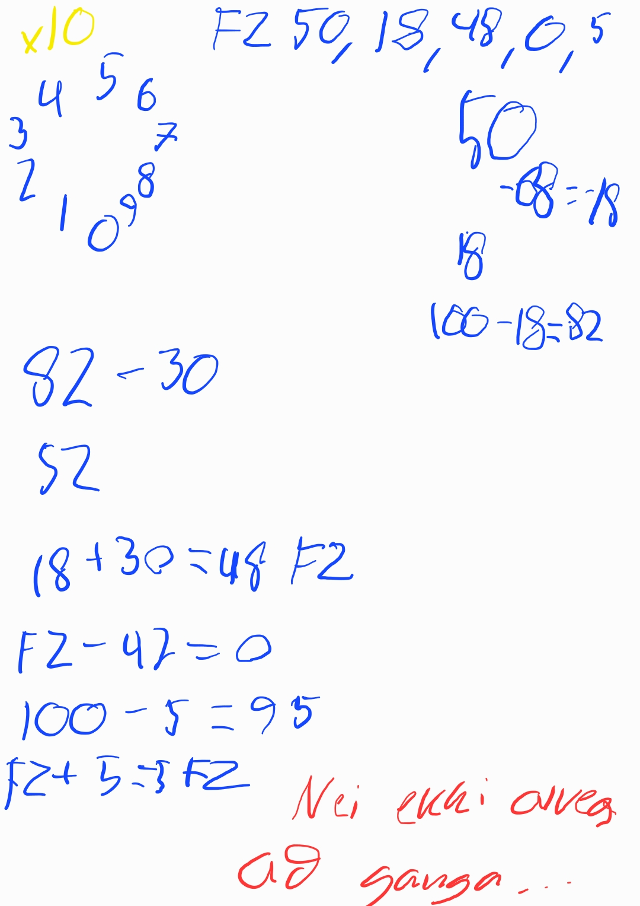
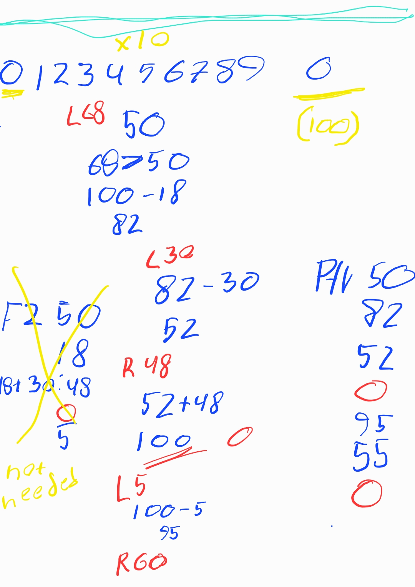
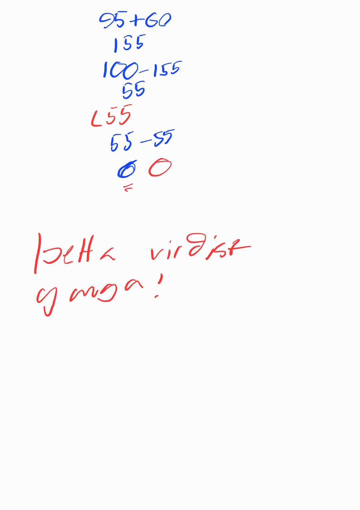

# 1.1

0-99, starts at 50.
count instances the rotor is at 0.
```
L68
L30
R48
L5
R60
L55
L1
L99
R14
L82
```
Following these rotations would cause the dial to move as follows:

    The dial starts by pointing at 50.
    The dial is rotated L68 to point at 82.
    The dial is rotated L30 to point at 52.
    The dial is rotated R48 to point at 0.   <-- no1
    The dial is rotated L5 to point at 95.
    The dial is rotated R60 to point at 55.
    The dial is rotated L55 to point at 0.   <-- no2
    The dial is rotated L1 to point at 99.
    The dial is rotated L99 to point at 0.   <-- no3
    The dial is rotated R14 to point at 14.
    The dial is rotated L82 to point at 32.

Because the dial points at 0 a total of three times during this process, the password in this example is 3.


### pseudo code thinking
```
```



